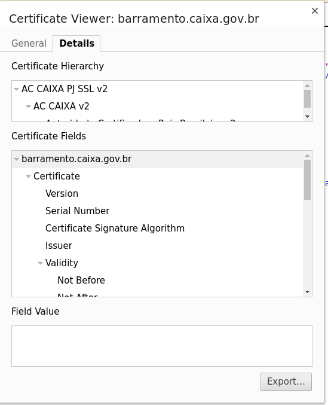

1. Download certificate using your browser. Ex

[](https://rafaelszp.files.wordpress.com/2018/12/DeepinScreenshot_select-area_20181220152815.png)

1. Import certificate to keystore. Ex.:

```
#Import to keystore
keytool -importcert -file caixa.cer -keystore keystore.jks -alias "caixa"

```

1. Run wsimport class from tools.jar. Ex.:

```
#Running wsimport
java -cp /home/rafael/dev/ssd/jdk/jdk1.8.0_191/lib/tools.jar -Djavax.net.ssl.trustStore=keystore.jks com.sun.tools.internal.ws.WsImport -s src -keep "https://barramento.caixa.gov.br/sibar/ConsultaCobrancaBancaria/Boleto?wsdl" 

```

A fully working example can be found in: [https://github.com/rafaelszp/wstestcaixa](https://github.com/rafaelszp/wstestcaixa)
