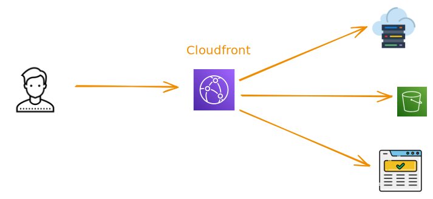

# AWS CloudFront - Visão geral

Created: 2024-06-05 08:05

Tags: `#aws` `#cloudfront` `#cdn`

## O que é?

AWS CloudFront é o serviço distribuído de entrega de conteúdo, a grosso modo podemos dizer que é um serviço de cache de conteúdo estático. É consistido por um alto número de servidores de borda, atuando nos POPs (Points of Presence), para habilitar uma entrega de conteúdo mais rápida e mais eficiente.

Para fazer esta entrega mais rápida, por padrão, este serviço disponibiliza o conteúdo em mais de **225 locais de borda** e mais de **13 caches regionais intermediários**, distribuídos em mais de **47 países**. Além disto, a sincronização entre todos os caches é automática, não sendo necessária nenhuma interação do usuário para isto.

## Componentes básicos

Este serviço possui componentes básicos, a saber:
- **Origin** - podemos definir a origin como o local onde residem as informações que serão distribuídas globalmente. Estas fontes podem ser quaisquer serviços que operem com protocolo HTTP, como por exemplo S3, HTTP server, container NodeJS, etc
- **Distribution** - É a instância do Cloudfront, onde definimos todas as configurações, comportamentos, grupos de origins.
- **Lambda@Edge** São funções Lambda executadas diretamente no Cloudfront para podermos personalizar como trataremos o cache.
- **Cloudfront Functions** - São funções nativas do CloufFront para estender o comportamento das requisições.

## Principais benefícios

Dentre os principais benefícios podemos citar 2: rápido tempo de resposta e custo efetivo. Outros benefícios importantes serão discutidos a seguir.

### Tempo de resposta rápido

Para acelerar o tempo de resposta, o CloudFront utiliza várias técnicas de aceleração de entrega de conteúdo a nível de protocolo TCP, valendo destacar as seguintes:

| Técnica | Descrição | Minhas considerações |
|----|----|----|
| **TCP fast-open (TFO)** | Esta técnica permite que dados enviados juntamente com os sinais SYN e SYN-ACK, economizando o RTT (Round Trip Time). | Por haver menor RTT em consequência de menos requisições, há melhora na latência |
| **Request collapsing** | Por padrão um cache miss tem como consequência uma requisição no origin, assim, se houver muitos cache miss concorrentes, o origin ficará sobrecarregado, causando latência. O que esta técnica faz é condensar todas as requisições cache-miss em solicitação única ao origin. | Com esta técnica, o origin não sofrerá sobrecarga, todas as requisições "gêmeas" serão tratadas como uma só e respondidas corretamente aos solicitantes, aumentando a eficiência dos serviços |
| **Keep alive** | Esta técnica consiste em aproveitar a mesma conexão para todas as requisições subsequentes, evitando repetição de handshakes uma vez que já foi executado em requisições anteriores. | Por aproveitar a conexão de requisições anteriores, há uma economia de tempo, pois o processo de handshake consome um pouco do tempo das requisições, principalmente se utilizarem TLS. |

### Segurança

No aspecto de segurança podemos destacar que, nativamente, o serviço suporta o protocolo TLS (v1.3\*), além de ser possível permitir ou bloquear acessos de determinados países.
Para aumentar a segurança, é possível integrar o CloudFront ao AWS WAF, de forma que é possível proteger o serviço e seus usuários dos principais tipos de ataque, como os listados na [TOP 10 OWASP:2021](https://owasp.org/Top10/)

Outro aspecto importante é que com o CloudFront, podemos deixar os recursos(origins) privados, sendo que o acesso ao público seja realizado através deste serviço, podendo acrescentar:
- Autenticação, gerenciada por funções Lambda@Edge
- URLs temporárias assinadas, por meio par de chaves assimétricas

Ainda é possível, nativamente, restringir ou limitar o acesso por geolocalização, porém é importante ressaltar que a acurácia é de 99,8%, ou seja, não há garantia integral de restrição ou limitação.

#### Restrição de acesso ao origin

O CloudFront consegue acessar serviços nativos da AWS de 3 formas:
- Recursos com acesso **Público**
- Acesso controlado por **Origin Access Identity** (OAI), que é a política do tipo identity based, aplicada a usuários, grupos e roles. Esse modelo de acesso é considerado legado e é recomendado usar o OAC
- Acesso controlado por **Origin Access Control** (OAC), que é a política do tipo *resource based*, ou seja, aplicada diretamente no recurso que servirá como origin

Devido ao OAC não há necessidade de manter o acesso público aos recursos, melhorando o aspecto de segurança do conteúdo que desejamos servir.

### Personalização de comportamento

Um funcionalidade importante deste serviço é que é possível personalizar o comportamento da Distribution e como lidar com cada entrada do cache. De forma que cada requisição recebe um `cache key`, que determina se o conteúdo será trazido diretamente o cache ou se o CloudFront deve requisitá-lo da origin.

O `cache key` é controlada por uma **cache policy** que pode ser dos seguintes tipos:
- **AWS Managed** - consistida pelo *domain name* da distribution e o request path
- **Custom** - Podemos definir quais partes da requisição farão parte do `cache-key`, por exemplo, headers específicos, query strings ou cookies

É importante ressaltar que um `cache hit` ocorre ocorre quando uma *viewer request* gera o mesmo cache-key das requisições anteriores, e o objeto referente a essa chave está no cache do local de borda, considerando que seja válido.

Além disto, podemos utilizar os headers `Cache-Control` e `Expires` para determinar quando o CloudFront irá trazer o conteúdo diretamente o cache ou se irá buscar diretamente no origin (forward request).

#### Eventos que ativam funções Lambda@Edge

As **Lambda@Edge** são funções indicadas para operações mais complexas, sendo ideais para cenários que precisemos interagir com outros serviços alheios ao CloudFront para servir conteúdo, como por exemplo interagir com o DynamoDB.

É possível realizar alteração de comportamento de 4 formas, por meio de gatilhos (triggers do CloudFront) que ativam funções, sendo:

| Evento | Quando ocorre | Não executa ... |
|----|----|----|
| Viewer Request | Quanto o CF recebe a requisição, antes de checar se está no cache | \- |
| Origin Request | Apenas quando o CF encaminha a requisição para o origin, | \- Quando o objeto está no cache |
| Origin Response | Depois que o CF recebe a resposta do origin, antes de colocar o objeto no cache. É executada mesmo se houver erro no origin | \- Quando o objeto o arquivo está no cache e não está expirado
- Quando a response é gerada por uma Function que foi ativada por um Origin Request
 |
| Viewer Response | Executada antes que o arquivo seja enviado ao usuário, mesmo que o objeto já esteja no cache | \- Origin retorna código 400+
- Quando página de erro é retornada

- Quando o response é gerado por uma function ativada na Viewer Request

- Quando o CF redireciona de HTTP para HTTPS (Viewer policy = Redirect HTTP to HTTPS)
 |

Vale ressaltar que é possível utilizar paralelamente funções para cada evento, observando as restrições de ativação, conforme quadro acima.

#### Eventos que ativam funções CloudFront

As **CloudFront Functions** são funções para processamentos rápidos, que levem menos de 1ms para executar. Os usos mais indicados são:
- Normalização de cache-key
- Roteamento: redirect e rewrite
- Autorização, como validação e/ou inspeção do baseado no conteúdo do header Authorization

#### Origin Shield

O CloudFront possui uma funcionalidade chamada de Origin Shield, que consiste em proteger o origin contra múltiplas requisições quando ocorrerem *cache miss*. De forma que age como um concentrador de requisições provenientes dos locais de borda, realizando somente uma única requisição ao origin e entregando o conteúdo desejado. Em consequência disso, os *cache hit ratios* são melhorados.

Outro detalhe importante é que as Cloudfront Functions lidam somente com 2 tipos de eventos: Viewer Request e Viewer Response.

#### Failover

É possível definir um grupo secundário de origins para casos de falhas do grupo primário de origins. Assim, se o grupo primário responder com um status code de erro, o CloudFront irá solicitar os objetos diretamente ao grupo secundário, garantindo alta disponibilidade.

### Custo efetivo

O custo benefício desse serviço é um aspecto importante a ser considerado, ainda mais se levamos em conta que o tráfego entre o CloudFront e outros serviços nativos da AWS é cobrado.

Além disto, podemos otimizar o custo ao utilizar a configuração **Price Class** que nos permite configurar em quais locais de borda teremos o conteúdo distribuído, sobrescrevendo o comportamento padrão que é de distribuir em todos os pontos de presença. Com o uso desta configuração o conteúdo continuará sendo acessível globalmente, porém o tráfego será otimizado somente nos locais pertencentes àquele Price Class. É importante ressaltar aqui que os Edge Locations são separados em classes 3 classes (até a presente data), o que torna esta característica um pouco inflexível.

#### Cobrança

A cobrança é feita, basicamente, em 3 aspectos:
- Por transferência de dados, ou seja, a quantidade de dados que é enviada aos usuários finais, havendo diferenciação de custo por HTTP ou HTTPS
- Por requisição, em que é cobrado o número de requisições, diferenciadas pelo tipo do método (GET, POST, HEAD, etc...)
- Por invocação de *Edge Functions*, sendo que o Lambda@Edge é cobrada por cada 1ms de processamento
- Taxas adicionais são cobradas por uso de SSL/TLS
- Taxas adicionais são cobradas por invocação de rotina de invalidação de cache

## Monitoramento

O CloudFront é integrado nativamente ao CloudWatch, e possui as seguintes métricas capturadas:
- Estatíticas gerais de cache - hits, misses, status code, methods
- Objetos populares - mais acessados e os hit ratios
- Top Referrers - top 25 fontes de requisições
- Uso geral - Número de requisições e transferência por protocolo
- Visualizadores - informação sobre dispositivos, browsers, sistemas operacionais e locations

## Outros pontos a destacar

Além dos pontos supracitados, podemos destacar:
- Com o Lambda@Edge, é possível realizar um processo de autenticação personalizada, por exemplo, baseada em DB
- É possível rotear tráfego para diferentes versões e/ou origins de um determinado conteúdo, como por exemplo:
- Via custom cookie ou header
- Por geolocalização
- Por idioma
- É possível limitar os downloads realizados por um cliente, como por exemplo:
- Lambda@Edge Integrado ao DynamoDB para armazenar quantos dados o cliente baixou
- Uso do Header Content-length trazido por uma requisição HEAD do Lambda@Edge ao origin para realizar a contabilização de acesso do usuário
- Com o uso do Edge Functions, é preciso observar a quantidade de requisições, pois há custos de uso deste serviço
- É possível monitorar cada distribution no Cloudwatch
- Para acelerar o desenvolvimento, é possível testar as funções direto na console da AWS
- O logs da Edge Functions serão gravados na região onde foram invocadas, mesmo que tenham sido publicadas em outra região
- É possível integrar o CloudFront com o Route53, por meio de um CNAME
- É possível integrar o CloudFront ao AWS Certificate Manager
- É possível ter múltiplas regras de cache operando em paralelo, de forma que podemos, para alguns arquivos, retornar sempre a versão mais recentes, enquanto outros obedecerão as regras de TTL

## References

1.  AWS Cloudfront - My literature notes
2.  AWS Fundamentals Cloudfront
3.  TCP fast-open: https://www.rfc-editor.org/rfc/rfc7413
4.  Request collapsing: https://www.peakhour.io/blog/request-collapsing/
5.  Keep alive connections: https://www.imperva.com/learn/performance/http-keep-alive/
6.  Price class: https://docs.aws.amazon.com/AmazonCloudFront/latest/DeveloperGuide/PriceClass.html
7.  Price class values: https://docs.aws.amazon.com/AmazonCloudFront/latest/DeveloperGuide/distribution-web-values-specify.html#DownloadDistValuesPriceClass
8.  CloudFront Trigger Events: https://docs.aws.amazon.com/AmazonCloudFront/latest/DeveloperGuide/lambda-cloudfront-trigger-events.html
9.  Caching duration and mininum TTL: https://docs.aws.amazon.com/AmazonCloudFront/latest/DeveloperGuide/RequestAndResponseBehaviorS3Origin.html#RequestS3Caching
10. Cache-control header: https://developer.mozilla.org/en-US/docs/Web/HTTP/Headers/Cache-Control
11. Escolhendo as edge functions: https://docs.aws.amazon.com/AmazonCloudFront/latest/DeveloperGuide/edge-functions-choosing.html
12. Example code of CF Signed URL: https://github.com/rafaelszp/studies-cloudfront-signed-url
